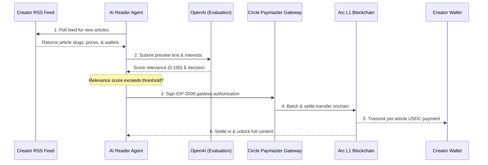
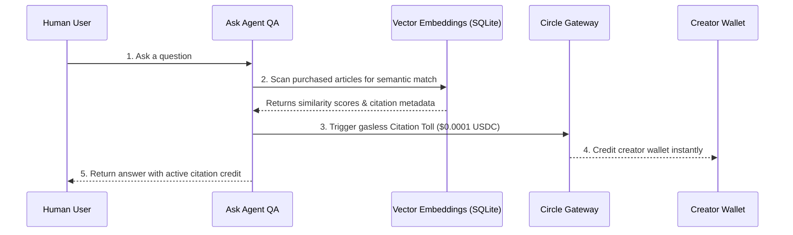

# Inktoll Protocol
> **Gasless Micropayment & Citation Settlement Highway for the Agentic Web3 Knowledge Economy**

Built with **Circle Programmable Wallets**, **Circle Gateway Nanopayments**, and settled on the **Arc Testnet** (USDC-native gas chain) for sub-second, frictionless machine-to-human payments.

---

## The Vision & Problem
Large Language Models (LLMs) and autonomous AI agents are crawling the web and consuming creators' valuable content for free. In response, publishers are implementing paywalls, putting up aggressive robots.txt blocks, and fracturing the open web. 

**Inktoll solves this crisis by introducing a two-layer machine-to-creator payment protocol:**
*   **Layer 1: Pay-Per-Read:** Autonomous AI agents discover monetize-ready articles via standard RSS feeds, evaluate content relevance using LLMs, and pay creators instantly in USDC for per-article read access.
*   **Layer 2: Citation Tolls:** When agents retrieve knowledge from previously purchased articles to answer human user questions, the protocol detects the semantic citation and routes an automatic **Citation Toll ($0.0001 USDC)** to the creator's wallet.

Inktoll turns content consumption into a functioning Web3 micro-economy where creators get paid directly, agents read legally, and developers operate gaslessly.

---

## Key Innovations (Hackathon Highlights)

### "Proof of Authorship" Verification Badge
To combat plagiarism and ensure secure compensation, Inktoll guarantees 100% of the USDC goes directly to the original creator. Every article in the Reader Feed and Creator Dashboard displays a verified status badge. Unlike competitors that let anyone paste any random URL to hijack revenue, Inktoll relies on secure API handshakes with the creator's platform (such as Ghost) to verify ownership.

### State-of-the-Art Onboarding Tour (Joyride)
To bridge the Web2-to-Web3 divide for creators, the Inktoll Dashboard includes a fully interactive, native **Onboarding Guide** built with React Joyride. The tour highlights and explains complex Web3 elements like the difference between *All-Time Earnings* and *Claimable Balance*, how the *Sync Gateway* operates, and how to withdraw funds on the Arc L1 network, ensuring any traditional blogger feels immediately at home.

### Agent Personas & "Top Spender" Leaderboards
We brought the AI economy to life! Rather than treating AI agents as invisible scripts, Inktoll features a **Top Agent Fans** leaderboard in the Creator Dashboard. Real autonomous reader agents (e.g., `Agent_B2A9`) are ranked dynamically based on how much USDC they have spent unlocking content and citing works. This makes the abstract concept of a "Machine-to-Machine Economy" tangible, social, and extremely engaging.

### Emergent Agentic Swarm Protocol
To max out Agentic Sophistication, our agents don't just execute linear scripts - they exhibit **Decentralized Machine Consensus**. If one agent reads an article and scores it highly (> 85/100 relevance), it autonomously broadcasts a signal to a decentralized Gossip Network. Other listening agents will immediately detect this alpha signal, swarm the target URL, and trigger a cascading spike of gasless USDC payments to the creator without any human intervention.

### Zero-Gas Nanopayments via Circle Gateway
We integrated the **Circle Gateway** to batch gasless off-chain payment authorizations (EIP-3009 / ERC-20 transfers). This achieves sub-cent transactions ($0.001) with **zero gas fees** for the user, net-settling batches efficiently on the Arc L1 Testnet.

### State-of-the-Art Glassmorphism UX
The Inktoll Dashboard isn't just functional; it's a visual experience. Built with Next.js and Framer Motion, it features a dark futuristic aesthetic, staggered micro-animations, animated 3D tracking cards, and customized Lucide React icons replacing standard emojis for a premium Web3 infrastructure feel.

---

## Content Platform Integrations

Inktoll fits into a creator's existing workflow by pulling content directly from where they already publish:

*   🟢 **Ghost (LIVE & Fully Integrated)**: Creators can onboard instantly by pasting their blog URL and Content API Key. Inktoll securely syncs and indexes their feed gaslessly.
*   🔵 **X (Twitter) (30% Developed - In Progress)**: A strategic roadmap milestone. Utilizing X OAuth 2.0 and X API v2, creators will be able to stitch together their high-value Twitter threads and monetize social media insights for AI agents.
*   🟡 **WordPress (Coming Soon)**: Integration with the WP REST API v2.
*   🟡 **Substack (Coming Soon)**: Integration with Substack RSS syndication.

---

## Circle Tool Usage & Tech Stack
*   **Circle App Kit & Programmable Wallets**: Frictionless Web2 onboarding for Creators with zero seed-phrases. Creators can log in via **Email OTP (Magic Links)** or **Biometric Passkeys (Smart Accounts)**—making Web3 completely invisible.
*   **Circle Gateway & Unified Balances**: We integrated the Circle Gateway to pool liquidity and hold unified USDC balances. Agents automatically use `depositFor` to deposit base USDC into the Gateway smart contract, enabling instant, cross-chain gasless nanopayments.
*   **Circle Developer-Controlled Wallets**: Secure, programmatic Web3 identity and custodial capabilities for our backend, handling real-time splits on Arc Testnet (routing 99% to creators and a 1% protocol fee to the Inktoll Treasury) upon withdrawal.
*   **Smart Contracts on Arc L1**: We deploy payment logic directly on the Arc Testnet, utilizing USDC as the native gas token for sub-second finality.
*   **x402 Protocol**: We implement HTTP 402 "Payment Required" flows tailored for AI agent execution, creating an autonomous M2M content handshake.
*   **USDC**: The native settlement layer of the protocol, ensuring creators are paid in a universally pegged, stable asset.
*   **AI & Logic Layer**: LangChain and OpenAI `gpt-4o-mini` drive the agent's autonomous relevance scoring and emergent swarm discovery.
*   **Frontend & Database**: Built using Next.js 16, Vanilla CSS, `framer-motion`, and a SQLite ledger.

---

## Protocol Architecture

### 1. Layer 1: Pay-Per-Read Flow


### 2. Layer 2: Citation Tolls Flow


---

## Project Structure
```bash
├── dashboard/      # Next.js web dashboard (Creator Hub, Reader Setup, Leaderboard, Ask Agent)
├── server/         # Node/Express backend SQLite ledger & RSS feed generator
├── agent/          # Autonomous AI Reader Agent runtime & microservices
└── .env            # Shared environment variables
```

---

## Getting Started (Local Setup)

### 1. Prerequisites
Create a `.env` file in the root directory by copying the template:
```bash
# Server Port Configuration
PORT=3001
AGENT_PORT=3002

# API Access
OPENAI_API_KEY=your_openai_api_key
CIRCLE_API_KEY=your_circle_api_key

# Settlement Configuration (Arc Testnet)
ARC_RPC_URL=https://rpc.testnet.arc.network
ARC_USDC_ADDRESS=0x3600000000000000000000000000000000000000
FAUCET_PRIVATE_KEY=your_faucet_private_key_with_usdc
```

### 2. Install & Start Server
```bash
# Navigate to backend server
cd server
npm install
npm run build
npm start
```
*   *Server runs at `http://localhost:3001`*

### 3. Install & Start AI Reader Agent
```bash
# Navigate to Agent client
cd ../agent
npm install
npm run build
npm start
```
*   *Agent microservice runs at `http://localhost:3002`*

### 4. Install & Start Web Dashboard
```bash
# Navigate to Dashboard web app
cd ../dashboard
npm install
npm run build
npm start -- -p 3005
```
*   *Dashboard is live at `http://localhost:3005`*

### 5. Production Deployment (VPS)
We include an `ecosystem.config.js` file for seamless production deployments on a VPS.
```bash
npm install -g pm2
pm2 start ecosystem.config.js
```
*This spins up both the Backend Server and Autonomous Agent Loop as robust background daemons keeping them online 24/7.*

---

## License
MIT License. Created by [MrNetwork](https://x.com/encrypt_wizard). Built for the Lepton Agents Hackathon by TheCanteen.
