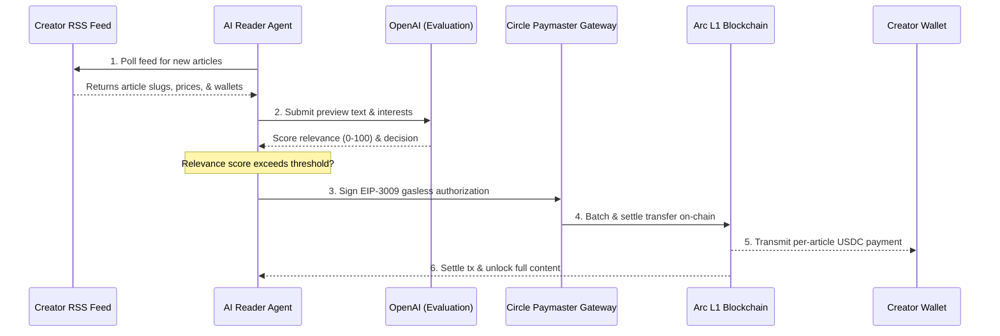
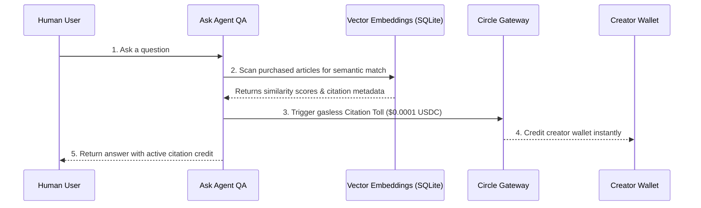

# 🏆 Inktoll Protocol
> **Gasless Micropayment & Citation Settlement Highway for the Agentic Web3 Knowledge Economy**

Built with **Circle Programmable Wallets**, **Circle Gateway Nanopayments**, and settled on the **Arc Testnet** (USDC-native gas chain) for sub-second, frictionless payments.

---

## 💡 The Vision & Problem
Large Language Models (LLMs) and autonomous AI agents are crawling the web and consuming creators' valuable content for free. In response, publishers are implementing paywalls, putting up aggressive robots.txt blocks, and fracturing the open web. 

**Inktoll solves this crisis by introducing a two-layer machine-to-creator payment protocol:**
*   **Layer 1: Pay-Per-Read:** Autonomous AI agents discover monetize-ready articles via standard RSS feeds, evaluate content relevance using LLMs, and pay creators instantly in USDC for per-article read access.
*   **Layer 2: Citation Tolls:** When agents retrieve knowledge from previously purchased articles to answer human user questions, the protocol detects the semantic citation and routes an automatic **Citation Toll ($0.0001 USDC)** to the creator's wallet.

Inktoll turns content consumption into a functioning Web3 micro-economy where creators get paid directly, agents read legally, and developers operate gaslessly.

---

## 🛠️ Tech Stack & Integration
*   **Circle SDKs**:
    *   **User-Controlled & Developer-Controlled Wallets**: Seamless passkey and MPC wallet generation.
    *   **Circle Gateway Client**: Batching gasless off-chain payment authorizations (EIP-3009 / ERC-20 transfers) with zero user gas fees.
*   **Arc Testnet**: Settles micropayments gaslessly using USDC as the native gas token, delivering sub-second finality.
*   **AI & Logic Layer**: LangChain and OpenAI `gpt-4o-mini` drive the agent's autonomous relevance scoring and citation detection.
*   **Web Dashboard**: Built using Next.js 16 (App Router), Vanilla CSS, and beautiful Glassmorphism design aesthetics.
*   **Database**: SQLite metadata storage ledger for transaction audits, active agent tracking, and leaderboard data.

---

## 📐 Protocol Architecture

### 1. Layer 1: Pay-Per-Read Flow


### 2. Layer 2: Citation Tolls Flow


---

## 📂 Project Structure
```bash
├── dashboard/      # Next.js web dashboard (Creator Hub, Reader Setup, Leaderboard, Ask Agent)
├── server/         # Node/Express backend SQLite ledger & RSS feed generator
├── agent/          # Autonomous AI Reader Agent runtime & microservices
└── .env            # Shared environment variables
```

---

## ⚡ Getting Started (Local Setup)

### 1. Prerequisites
Create a `.env` file in the root directory by copying the template:
```bash
# Server Port Configuration
PORT=3001
AGENT_PORT=3002

# API Access
OPENAI_API_KEY=your_openai_api_key
CIRCLE_API_KEY=your_circle_api_key

# Settlement Configuration (Arc Testnet)
ARC_RPC_URL=https://rpc.testnet.arc.network
ARC_USDC_ADDRESS=0x3600000000000000000000000000000000000000
FAUCET_PRIVATE_KEY=your_faucet_private_key_with_usdc
```

### 2. Install & Start Server
```bash
# Navigate to backend server
cd server
npm install
npm run build
npm start
```
*   *Server runs at `http://localhost:3001`*

### 3. Install & Start AI Reader Agent
```bash
# Navigate to Agent client
cd ../agent
npm install
npm run build
npm start
```
*   *Agent microservice runs at `http://localhost:3002`*

### 4. Install & Start Web Dashboard
```bash
# Navigate to Dashboard web app
cd ../dashboard
npm install
npm run build
npm start -- -p 3005
```
*   *Dashboard is live at `http://localhost:3005`*

---

## ✨ Winning Hackathon Features

### 🏆 Real-Time Ecosystem Leaderboard
*   Located at `/leaderboard`, it aggregates stats directly from the SQLite ledger: **Global USDC Circulated**, **Articles Indexed**, and **Active Reader Agents** online.
*   Features a **Live Ticker Feed** showing agent payment events dynamically as they settle.
*   Stats auto-hydrate in **real time every 5 seconds** across the landing page and leaderboard to simulate a living machine economy.

### 🔒 Balance Privacy Mode
*   Creators can toggle off the visibility of their earnings and metrics globally across the dashboard with one click, protecting sensitive balance sheets during live demos or stream recordings.

### 🎨 Fully Integrated Glassmorphism UX
*   Ditched crude browser popups (`alert` & `prompt`) for a custom-built, React-native **Modal Dialog & Slide-In Toast System** styled to match the dark futuristic design aesthetic of Inktoll.

---

## ⚖️ License
MIT License. Created by [mrnetwork0001](https://github.com/mrnetwork0001). Built for the Lepton Agents Hackathon by TheCanteen.
