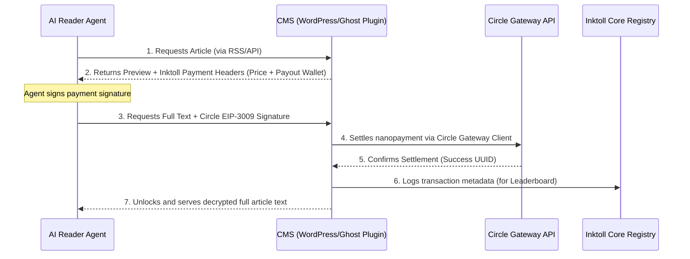

# 🧭 Inktoll Publisher Plugin Roadmap
> **Architectural Specification & Development Guide for WordPress & Ghost Integrations**

This document outlines the design, execution steps, and transaction flows for building plug-and-play publisher plugins that allow any website to monetize AI agent crawling gaslessly in USDC.

---

## 📐 Conceptual Architecture
Instead of relying on a centralized registry server to scrape RSS feeds, a local publisher plugin turns a creator's CMS (Content Management System) into a decentralized agent-decryption node.



---

## 📦 Core Component Specs

### 1. Metadata Schema (RSS/Atom Feeds)
The plugin automatically hooks into the site's default feed generators and appends custom XML namespaces to index prices and payouts:

```xml
<rss version="2.0" xmlns:inktoll="https://inktoll.com/schema/rss/1.0/">
  <channel>
    <item>
      <title>Evolving Agentic Ecosystems</title>
      <link>https://blog.com/posts/evolving-agentic-ecosystems</link>
      <inktoll:priceUsdc>0.0050</inktoll:priceUsdc>
      <inktoll:payoutAddress>0xcd0a2370f2dc12c1802707b7d9ab3fec891e3c02</inktoll:payoutAddress>
    </item>
  </channel>
</rss>
```

### 2. Payment Middleware Gate
The plugin intercepts crawling bots by verifying user-agent strings. 
*   If a bot requests `/posts/slug` directly, the server returns the preview snippet accompanied by `402 Payment Required` headers:
    *   `X-Inktoll-Price-USDC: 0.0050`
    *   `X-Inktoll-Recipient: 0xcd0...`
    *   `X-Inktoll-Unlock-Path: /wp-json/inktoll/v1/unlock`

### 3. Verification & Decryption API
The plugin provides a custom endpoint (e.g. `/wp-json/inktoll/v1/unlock`) to process EIP-3009 signatures:
*   **Request Method**: `POST`
*   **Payload**:
    ```json
    {
      "slug": "evolving-agentic-ecosystems",
      "fromAddress": "0x44978b7f924c0c6bed1E2acCa887338Dc47C4539",
      "signature": "0x...",
      "nonce": "12984712",
      "deadline": 1782800000
    }
    ```
*   **Process**:
    1. Verifies the signature matches the sender's address.
    2. Submits the batch authorization to Circle's x402 Gateway.
    3. On `200 OK` settlement from Circle, retrieves the full post content from the CMS database and returns it in JSON.

---

## 🛠️ CMS Integration Specs

### A. The WordPress Plugin (PHP & Javascript)
1.  **Plugin Setup Page**:
    *   A dashboard setting to connect the publisher's wallet.
    *   Price configuration rules (e.g. set default price per read, specify certain tags as free or premium).
2.  **Filter Hooks**:
    *   `rss2_item` or `the_excerpt_rss` filter to output Inktoll tags inside feed loops.
    *   `template_redirect` to block full-content views for bots without validated payment.
3.  **Rest API Controller**:
    *   Uses WordPress `register_rest_route` to create the `/unlock` endpoints.

### B. The Ghost Integration (Node.js Theme / Adapter)
1.  **Theme Custom Helper**:
    *   Create a custom theme helper (e.g., `{{#ifInktollPaid}}`) that conditionally displays body HTML.
2.  **Ghost Webhook integration**:
    *   An admin panel webhook setting that triggers on `post.published` to notify the centralized Inktoll registry database to index the new feed immediately.

---

## 🌟 Strategic Project Pitch (Hackathon Story)
*   **Scalability**: By building plugins, Inktoll removes the friction of manual onboarding. A writer installs a plugin in 2 clicks, and their blog is immediately configured to receive onchain rewards from any autonomous agent in the world.
*   **Decentralized Paywalls**: No centralized paywall service takes a cut. The content stays on the creator's site, and funds route directly from the reader agent to the creator's wallet.
